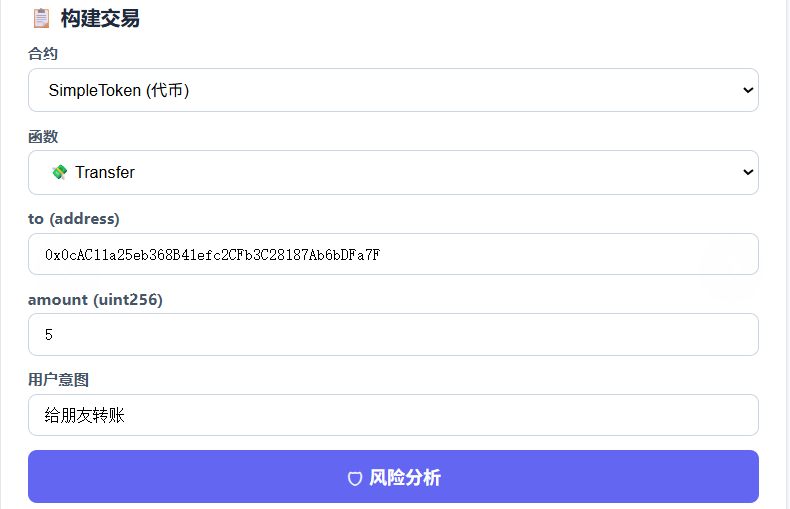
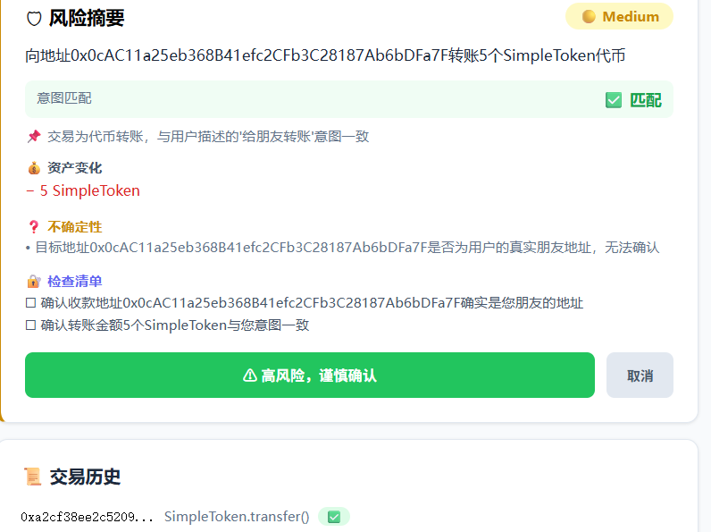
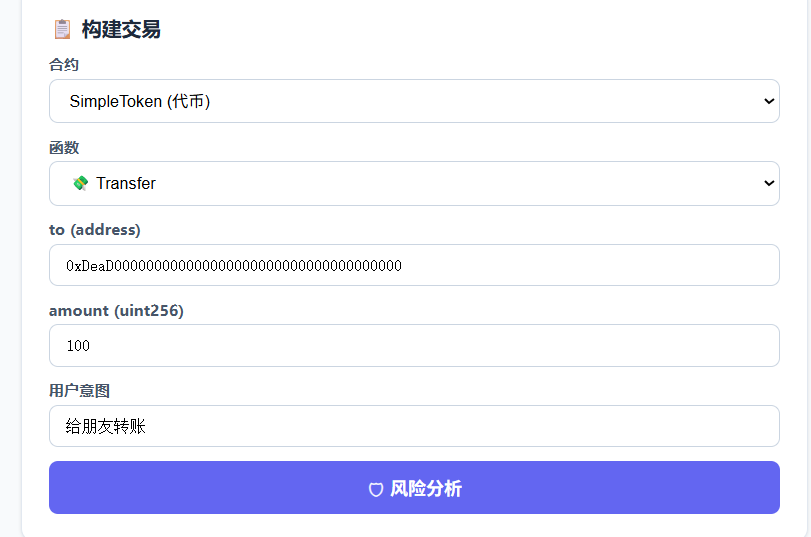
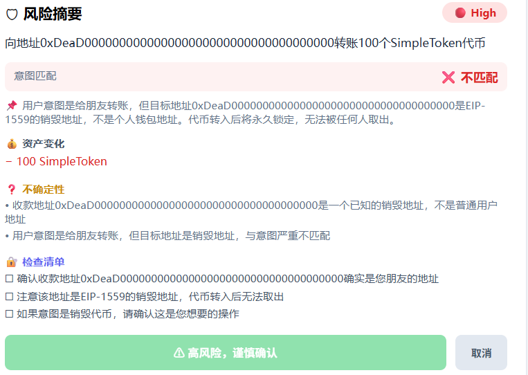

# Day 2 — 交易风险分析器

> **日期：** 2026-05-19 / 2026-05-20
> **章节：** Prompt / Cryptography
> **技术栈：** Foundry (Solidity) + Go (Backend) + React (Frontend) + DeepSeek (LLM)
> **网络：** Sepolia 测试网

---

## 项目：交易风险分析器

**先分析，再签名。** 输入交易参数和用户意图，LLM 返回结构化风险评估。

### Prompt 设计

**Instruction 四段式：**
```
1. 任务目标: 分析交易风险并输出结构化 JSON
2. 可用输入: to / data / value / user_intent
3. 禁止行为: 不能忽略无限授权 / 不能忽略地址不匹配
4. 输出格式: 严格 JSON schema
```

**Few-shot：** ABI 映射（选择器 → 函数名）作为隐式示例 + 风险分类规则

**Structured Output：**
```json
{
  "summary": "一句话总结",
  "asset_changes": [{"asset", "amount", "direction"}],
  "permissions_changed": [{"contract", "permission", "detail"}],
  "risk_level": "low|medium|high|critical",
  "requires_human_approval": true/false,
  "uncertainties": [],
  "recommended_user_checks": [],
  "intent_match": true/false
}
```

### 三组测试全部通过 ✅

| 测试 | 操作 | 预期 | 结果 |
|------|------|------|------|
| ① Counter.increment | 普通计数器操作 | 🟢 Low | ✅ Low, intent_match=true |
| ② Token.approve(0xdead..., ∞) | 无限授权 | 🚨 Critical | ✅ Critical, requires_approval=true |
| ③ Token.transfer(0xdead...) + 意图="给Alice" | 地址不匹配 | 🔴 High | ✅ High, intent_match=false |

### 新增组件

| 组件 | 说明 |
|------|------|
| `contracts/src/SimpleToken.sol` | 简版 ERC20（transfer/approve/transferFrom），6 tests ✅ |
| `backend/main.go` → `POST /api/analyze` | 交易风险分析 API |
| `frontend/src/App.jsx` | 风险分析面板（先分析后签名） |

### 截图

> 以下截图来自 dapp/ 目录，展示完整的交互流程。

| 界面 | 截图 |
|------|------|
| **Counter 主面板** — 连接 MetaMask 后直接读写合约 |  |
| **交易风险分析** — 选择操作、填写意图、分析风险 |  |
| **交易解释器** — 输入交易哈希，解析链上事实与模型推断 |  |
| **Token 信息** — SimpleToken 合约部署与交互 |  |

### 合约部署

| 合约 | 地址 |
|------|------|
| Counter | `0x6d8521408b803813a1A963f511C74fB96ea23bd2` |
| SimpleToken | `0x62E3395eCFa2d18afB8F0cfbB1FA55948Dd03674` |

---

## 学习笔记

### 🔵 Prompt 工程核心

| 概念 | 一句话理解 |
|------|-----------|
| **Instruction** | 给模型的任务规则：角色、目标、边界、输出格式 |
| **Few-shot** | 放少量示例让模型模仿判断方式和输出格式 |
| **Structured Output** | 模型按固定结构返回结果（JSON / schema） |
| **Prompt Injection** | 攻击者通过用户输入/网页/文档让模型忽略原始规则 |

**第一性原理：** Prompt 是软约束，不是安全边界。真正的边界必须由代码、权限、校验和审计来承担。

**最小实践收获：**
- Instruction 四段式（目标 / 输入 / 边界 / 输出格式）在风险分析场景中有效
- Structured Output 让前端可以做针对性 UI 展示（风险等级颜色、检查清单）
- 三组测试覆盖了正常操作、高风险操作、意图不匹配三种典型场景

### 🟢 密码学基础

| 概念 | 一句话理解 |
|------|-----------|
| **Hash** | 把任意数据变成固定长度指纹，验证同一性和完整性 |
| **Public Key** | 公钥可以公开，用来推导地址或验证签名 |
| **Private Key** | 账户控制权本身，泄漏即失去所有权 |
| **Signature** | 私钥对消息生成的授权证明 |
| **Merkle Tree** | 用哈希组织大量数据，少量 proof 就能验证数据属于整体 |

**三条铁律：**
```
私钥是控制权  — 丢失 = 失去控制，泄漏 = 别人获得控制
签名是授权证据 — 签名内容必须能让人读懂，不能只展示一串数据
哈希是承诺    — 不能还原原文，但能验证数据有没有被改过
```
