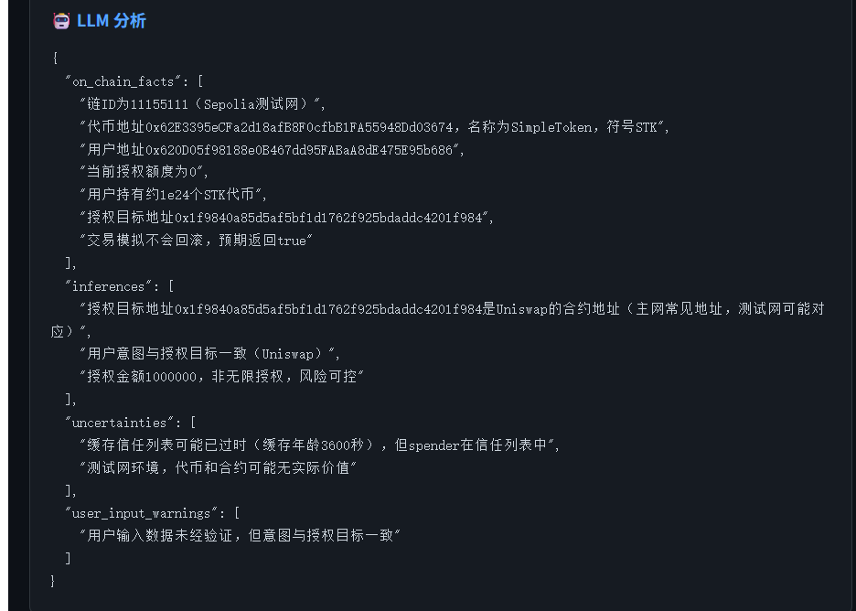
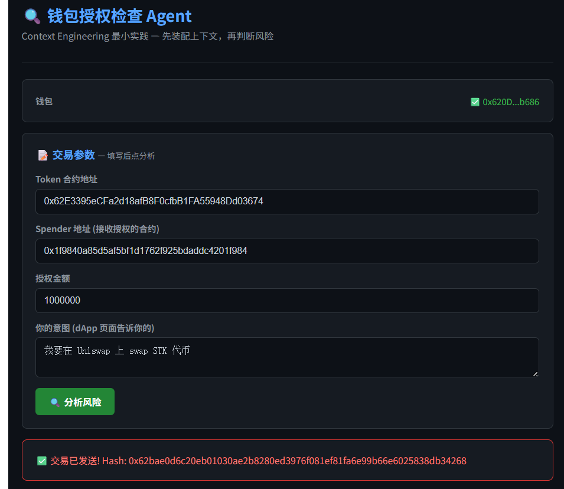
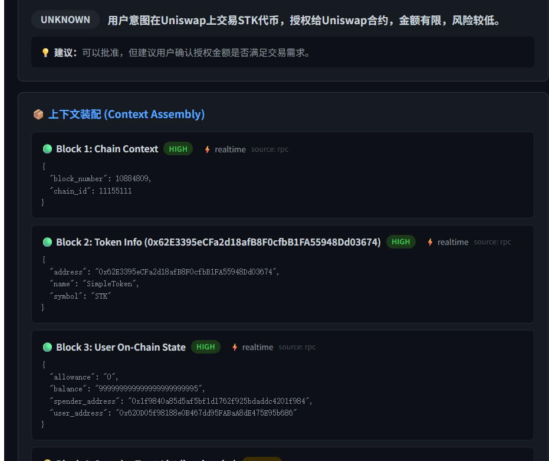
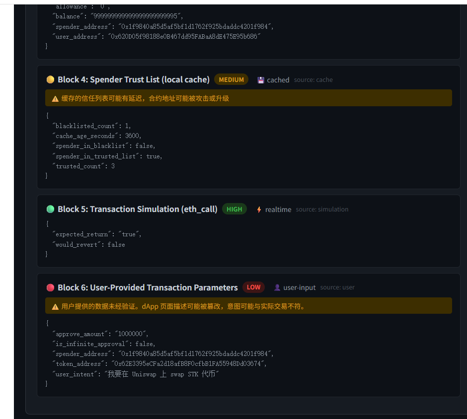

# Day 3 — Context 最小实践：钱包授权检查 Agent

> **日期：** 2026-05-20
> **章节：** Context（上下文）
> **核心：** Context Engineering — 为 LLM 装配可信上下文
> **技术栈：** Foundry (Solidity) + Go (Backend) + React (Frontend) + DeepSeek (LLM)
> **网络：** Sepolia 测试网

---

## 项目：钱包授权检查 Agent

**先检查上下文，再判断风险。** 输入 token 地址、spender 地址、授权金额和意图，系统装配多来源上下文后发给 LLM。

### 与 Day 1 / Day 2 的对比

| 天数 | 核心 | 问题 |
|------|------|------|
| Day 1 | 交易解释器 | 事后分析：这笔交易做了什么？ |
| Day 2 | Prompt 设计 | 如何写 Instruction/Few-shot 让模型输出风险分析？ |
| **Day 3** | **Context Engineering** | **放什么进上下文、从哪里来、可信度如何？** |

### Context Engineering 的核心：上下文来源标注

每个上下文块都带 3 个标签：

| 标签 | 取值 | 含义 |
|------|------|------|
| `[SOURCE]` | `rpc` / `cache` / `user` / `simulation` | 数据来源 |
| `[TRUST]` | `high` / `medium` / `low` | 可信度级别 |
| `[FRESH]` | `realtime` / `cached` / `user-input` | 时效性 |

### 装配流程

```
用户输入 (token, spender, amount, intent)
    ↓
┌─ Context Assembly ─────────────────────────────┐
│                                                 │
│  ⚡ [SOURCE: rpc]      TRUST: HIGH  实时链上数据  │
│    ├─ chain id + 当前区块号                      │
│    ├─ token 信息 (name/symbol/decimals)          │
│    └─ 用户 balance + allowance                   │
│                                                 │
│  ⚡ [SOURCE: simulation] TRUST: HIGH  eth_call   │
│    └─ 模拟 approve 执行，检查是否 revert          │
│                                                 │
│  💾 [SOURCE: cache]     TRUST: MEDIUM           │
│    └─ 本地可信 spender 列表 / 黑名单              │
│                                                 │
│  🔴 [SOURCE: user]      TRUST: LOW             │
│    └─ 交易参数 + 用户意图 ⚠️ 不可信              │
│                                                 │
└──────────────────────┬─────────────────────────┘
                       ↓
         🤖 LLM (带完整上下文元数据)
                       ↓
         📋 结构化风险评估
```

### 测试结果

| 测试 | 场景 | 结果 |
|------|------|------|
| ① | 正常 approve (100 STK，接收方在可信列表) | 🟡 **Medium** — 意图与代币不匹配，建议确认 |
| ② | 钓鱼：无限 approve 到黑洞地址，借口"领空投" | 🚨 **Critical** — 拒绝，不要签名 |

关键观察：**LLM 正确区分了"链上事实"和"缓存推断"**。在测试①中，模型主动标注了"缓存数据有1小时延迟，需注意合约状态可能已变化"。

### 截图

| 截图 |
|------|
|  |
|  |
|  |
|  |

### 运行方式

```bash
# 终端 1 — 后端
cd approval-checker/backend && ./server

# 终端 2 — 前端
cd approval-checker/frontend && npm run dev
```

然后打开 http://localhost:3000

### 项目结构

```
approval-checker/
├── contracts/             # Foundry 合约 (SimpleToken + TokenShop, 3 tests ✅)
├── backend/main.go        # Go 上下文装配引擎
├── frontend/src/App.jsx   # React 前端 (MetaMask + 表单 + 上下文查看器)
└── assets/                # 截图
```

---

## 学习笔记

### 🔵 Context 核心概念

| 概念 | 一句话理解 |
|------|-----------|
| **Context Window** | 模型一次请求能处理的最大上下文范围 — 大不等于好 |
| **Context Engineering** | 设计什么数据进上下文、排序、裁剪、标注来源、隔离不可信内容 |
| **Memory** | 跨请求保留的信息（用户偏好、历史任务）— 不能替代实时授权 |
| **Knowledge Base** | 可检索的外部知识库（文档、FAQ、SDK）— 按需取用 |

### 第一性原理

> Context 不是简单的长文本拼接，而是一套信息治理问题。
> 你要为每类信息标注**来源**、**时效**、**权限**和**可信度**。
> 否则模型会把"用户说的""网页写的""链上查到的""系统规定的"混在同一层处理。

### 最小实践收获

- **来源标注是 Context Engineering 的第一步。** 每个数据块都应该知道自己是哪里来的。
- **高可信数据（RPC）和低可信数据（用户输入）要分开。** 放在同一个段落里 LLM 会默认同等对待。
- **Simulation 是最被低估的安全工具。** `eth_call` 模拟执行 + LLM 解读 = 强大的事前检查。
- **Cache 数据要标注时效。** "spender 在可信列表" 和 "spender 1小时前在可信列表" 是两回事。
