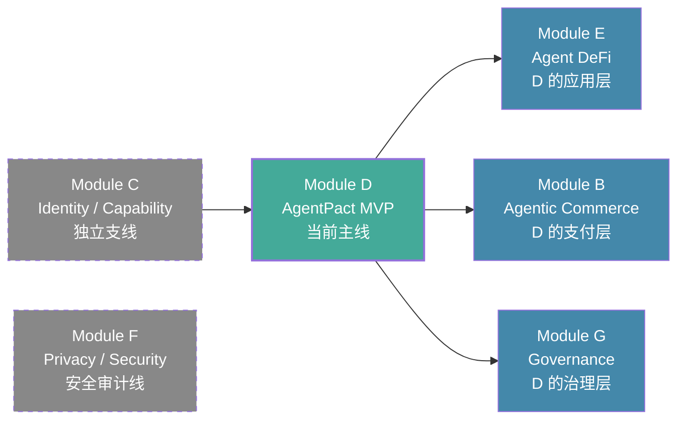

# 方向 Backlog 详化

> 日期：2026-05-25
> 主方向：Module D — Wallet / Permission / Safe Execution
> 用途：Week 2 交付物 #7 — 未选方向的后续价值判断与触发条件

---

## 总览：Backlog 地图



---

## 方向 B — Agentic Commerce / Payment

**来源**：Week 2 六个方向中的 #1
**标签**：`backlog` `medium-term` `protocol-level`

### 为什么不是现在

| 原因 | 说明 |
|:----|:-----|
| 协议层问题 | Payment/Clearing 是基础设施级（x402、escrow、machine payment），单人 Week 2 范围出不了可演示产物 |
| 前置依赖 | Agent commerce 的"谁付款、付多少、怎么结算"需要先有 agent 身份和权限方案（Module D 和 C） |
| 商业路径 | 纯 protocol 方案在没有真实用户/agent 前难以验证，"build it and they will come"不适合有限时间 |

### 触发条件

- [ ] AgentPact MVP v0 跑通（证明 agent 可以在边界内执行）
- [ ] 有明确的 machine-to-machine payment 场景需要 pact 的结算/escrow 能力
- [ ] Week 4 Hackathon 有 sponsor 赛道支持（如 Cobo CAW 的 Payment flow）

### 做什么（如果触发）

1. 在 Pact schema 增加 `settlement` 字段（currency / max_spend / escrow 合约地址）
2. AgentPact 的 budget control + 结算层对接 escrow 合约
3. Demo：agent 购买 API key / 数据包，用户在 Pact 内自动结算

### 学习价值（现在就可以顺带做）

- 理解 x402 paywall、cobowallet payment flow 的基本概念
- 记入 architecture knowledge base 即可，不需要动手

---

## 方向 C — Identity / Reputation / Capability

**来源**：Week 2 六个方向中的 #2
**标签**：`backlog` `infrastructure` `dependent-on-D`

### 为什么不是现在

| 原因 | 说明 |
|:----|:-----|
| 基建型方向 | DID / ENS / EAS 身份方案是底层设施，单点突破难变现 |
| 场景驱动 | "Agent 需要身份"的问题只有在 agent 真的开始执行任务后才成立——AgentPact 跑通就是最好的驱动场景 |
| 承接关系 | Module C 是 D 的前置身份层，反过来也可以先有 D 再引入 C（agent 身份由 Pact 签发） |

### 触发条件

- [ ] AgentPact 需要 agent-to-agent 交互（比如一个 agent 委托另一个 agent 执行子任务）
- [ ] 需要证明"这个 agent 是受合法 Pact 约束的"
- [ ] Week 4 Hackathon 有 Identity/DID 赛道

### 做什么（如果触发）

1. 为 agent 注册一个 ENS name 或 DID 标识
2. 在 Pact 中使用 agent DID 作为 principal
3. EAS attestation 绑定 agent 身份 + Pact scope → 可验证的"受约束 agent"

### 已经可以顺带学习的

- 把 agent profile / capability manifest 的自然语言设计思路记录到 Pact schema 的 metadata 字段
- 5/20 的 SimpleToken + TokenShop 合约中，agent 以 EOA 身份调用——这里天然缺了一个"谁是这个 agent 的背书者"

---

## 方向 F — Privacy / Security / Sovereignty

**来源**：Week 2 六个方向中的 #4（昨天倾向的方向）
**标签**：`backlog` `audit-security`

### 为什么不是现在

| 原因 | 说明 |
|:----|:-----|
| 偏研究/审计路径 | Prompt injection 防御、TEE 可验证执行、本地模型部署——4 周 hackathon 周期难以出可演示产品 |
| 用户基础不足 | AI Security 面向的是已有 Agent 产品的团队做审计加固，Week 2 的产出无法直接让黑客松评审理解 |
| 但天然嵌入 D | AI Security 的部分内容（Prompt Injection、Tool Abuse、Key Isolation）已经在 D 的风险表中出现，不是完全丢掉的 |

### 触发条件

- [ ] AgentPact v0 完成，需要做安全审计
- [ ] 业务场景涉及敏感数据（隐私合规要求）
- [ ] 有明确的"model independence"需求（不想依赖单一 LLM provider）

### 做什么（如果触发）

1. 对 AgentPact 系统做 Prompt injection 攻击演练（deep dive #7.4 已有场景设计）
2. Policy Engine 增加 LLM 输出校验层（防幻觉导致的超界授权）
3. 评估是否需要引入本地模型（Ollama / llama.cpp）处理敏感的 Pact 草案

### 已经嵌入 D 的内容（不用重复学习）

| F 中的内容 | 在 D 中的对应 |
|:----------|:--------------|
| Prompt Injection（R1） | 风险表 R1，缓解措施已设计（LLM 草案必须 user 签名 → schema 校验 → UI 高亮） |
| Tool Permission Isolation | Policy Engine 的分层决策（Layer 1-4） |
| Key / Secret Isolation | Session Key 不持主私钥（deep dive §1.1 Session Signer 角色） |
| AI Behavior Audit | Audit Log JSONL append-only + 可选 EAS attestation |

---

## 方向 G — Governance / Coordination

**来源**：Week 2 六个方向中的 #6
**标签**：`backlog` `low-priority`

### 为什么不是现在

| 原因 | 说明 |
|:----|:-----|
| 市场拉力弱 | DAO 活跃度不比 2022 峰值，当前 DAO 生态对 AI 产品的付费意愿和能力都有限 |
| 变现路径长 | Governance 工具通常是免费/开源/公共品定位，难以在 hackathon 展示"这能赚钱" |
| 已有 prototype | 5/22 的 DAO 提案研究 Agent 已经是 G 方向的最小实践，覆盖了"总结提案 + 生成检查清单"的核心能力 |

### 触发条件

- [ ] AgentPact 需要在 DAO 场景做"多签 guard"——Guard 的决策规则由 DAO 治理而非个人设定
- [ ] 5/22 prototype 需要扩展为可交互产品
- [ ] Week 4 Hackathon 有明确 Governance/Public Goods 赛道

### 做什么（如果触发）

1. 把 5/22 的提案 Agent 接入 AgentPact：DAO 发起 Pact → Agent 执行预算内事务 → audit log 供 DAO 复查
2. Policy Engine 的决策路由改为 quorum-based（N 个 signer 中 M 个批准）
3. Escalation 的目标从"个人用户"改为"DAO 投票"

### 已有基础

- 5/22 的 DAO 提案研究 Agent（`2026-05-22/`）已实现：提案分析 + 风险检查清单生成
- 该 Agent 是"只读 + 建议"级别，接入 AgentPact 后可升级为"有限执行"

---

## 方向 E — Agent DeFi（超前规划）

**来源**：Module D 的应用层扩展
**标签**：`future` `application-layer`

### 为什么不是现在

| 原因 | 说明 |
|:----|:-----|
| 需要 D 的基础 | Agent 做 DeFi 操作（swap、liquidity provision）需要先有 Pact + Policy Engine + Session Key 的权限层 |
| DeFi 实战经验 | 需要理解 Uniswap V3 的核心操作、slippage、MEV 风险——这部分需要单独学习 |

### 触发条件

- [ ] AgentPact v0 验证通过（三个测试用例全过）
- [ ] Pact schema + Policy Engine 的抽象层稳定，可以替换 target contract
- [ ] Week 3 或 Hackathon 需要展示"agent 在 pact 内做复杂操作"

### 做什么（如果触发）

1. 把 Policy Engine 的 target 从 TokenShop 替换为 Uniswap V3 Router
2. Pact 增加 swap-specific 字段：allowed_pools、max_slippage、price_oracle
3. Simulation 层增加 price impact 计算（不能只靠 eth_call）
4. 攻击演练增加"oracle manipulation"场景（R5）

---

## 总结：Week 2-4 的路线图

```
Week 2 (当前)           Week 3                  Week 4 (Hackathon)
                                   
┌─────────────┐    ┌─────────────┐    ┌──────────────────────┐
│ Module D    │    │ AgentPact   │    │ AgentPact v1         │
│ 设计阶段    │───→│ MVP 实现    │───→│ + 任选扩展：         │
│             │    │             │    │ · ERC-4337 集成      │
│ · 方向选择 ✅ │    │ · Policy    │    │ · Cobo CAW 对接     │
│ · 设计文档 ✅ │    │ · Pact UI  │    │ · Uniswap (E 方向)  │
│ · 参考清单 ✅ │    │ · Agent    │    │ · EAS attestation   │
│ · Backlog ✅  │    │    Loop     │    │ · 攻击演练          │
│ · Daily ✅   │    │ · Revoke   │    └──────────────────────┘
└─────────────┘    └─────────────┘
                        
                     Backlog (按需激活):
                     · B (Commerce)  → 等 payment flow 清晰
                     · C (Identity)  → 等 agent-to-agent 场景
                     · F (Security)  → 等安全审计需要
                     · G (Governance)→ 等 DAO 场景触发
```
