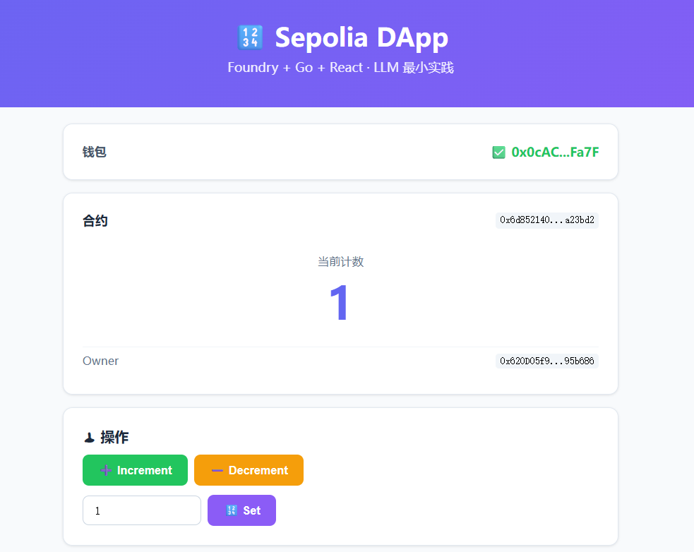
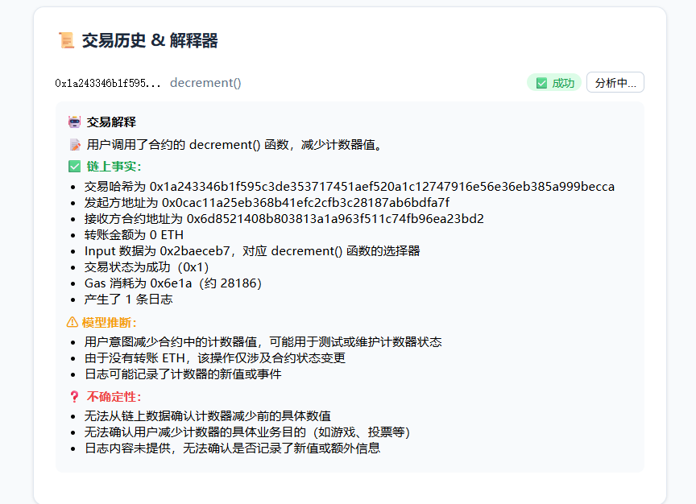

# Counter DApp — 交易解释器 + 风险分析器

> **归属：** AI × Web3 School
> - Day 1 — LLM 章节最小实践：交易解释器（事后分析）
> - Day 2 — Prompt 章节最小实践：风险分析器（事前防护）
>
> **技术栈：** Foundry (Solidity) + Go (Backend) + React (Frontend) + DeepSeek (LLM)
> **网络：** Sepolia 测试网

---

## 功能

### 🛡 交易风险分析器（Prompt 最小实践）
**先分析，再签名。** 输入交易参数和意图，LLM 返回风险评估。

三组测试用例：
| 测试 | 操作 | 风险等级 |
|------|------|---------|
| ① | Counter.increment() | 🟢 **Low** |
| ② | Token.approve(恶意地址, ∞) | 🚨 **Critical** |
| ③ | Token.transfer(恶意地址) + 意图="转给朋友" | 🔴 **High** |

### 🔍 交易解释器（LLM 最小实践）
**事后分析。** 输入交易哈希，解析链上数据。

---

## 截图

### DApp 主界面



*连接 MetaMask 钱包后，可直接在前端对合约进行 Increment / Decrement / SetCount 操作*

### 交易解释器



*每笔交易可点「🔍 解释」查看 LLM 分析结果，区分链上事实、模型推断、不确定性、检查清单*

---

## 项目结构

```
foundry-dapp/
├── contracts/              # Foundry 智能合约
│   ├── src/Counter.sol     # Counter 合约
│   ├── test/Counter.t.sol  # 7 个测试全部通过
│   ├── script/             # 部署脚本
│   └── foundry.toml        # Sepolia RPC 已配置
├── backend/                # Go 后端
│   ├── main.go             # REST API + DeepSeek 集成
│   └── go.mod / go.sum
├── frontend/               # React 前端 (Vite + viem)
│   ├── src/App.jsx         # 主页面
│   └── package.json
├── assets/                 # 截图等资源
├── .gitignore
└── README.md
```

---

## 架构设计

```
┌─ Browser ─────────────────────────────┐
│  MetaMask ←→ React (viem) ←→ Sepolia  │  ← 前端直接读写合约
│           ↕ fetch(/api/explain)        │
└──────────────────────┬────────────────┘
                       ↓
┌─ Go Backend (:8080) ─────────────────┐
│  handleExplain(txHash)                │
│    ├─ eth_getTransactionByHash        │  ← 从 Sepolia RPC 拿原始数据
│    ├─ eth_getTransactionReceipt       │  ← 拿回执+日志
│    └─ callDeepSeek()                  │  ← 组装数据 + ABI 上下文
└──────────────────────┬────────────────┘
                       ↓
┌─ DeepSeek API ───────────────────────┐
│  System: 你是交易解释助手 + ABI 规则   │
│  User:   交易哈希/金额/Input/状态/Gas  │
│  Output: 结构化 JSON                  │
│    ├─ on_chain_facts    ✅ 链上事实    │
│    ├─ model_inferences  ⚠ 模型推断    │
│    ├─ uncertainties     ❓ 不确定性    │
│    └─ user_checks       🔐 检查清单    │
└───────────────────────────────────────┘
```

---

## 快速开始

```bash
# 1. 编译合约
export PATH="$HOME/.foundry/bin:$PATH"
cd contracts && forge build

# 2. 测试合约
forge test

# 3. 部署到 Sepolia（需要 PRIVATE_KEY 和 Sepolia ETH）
export PRIVATE_KEY=0x...
forge script script/DeployCounter.s.sol --rpc-url sepolia --broadcast

# 4. 启动后端
export CONTRACT_ADDRESS=0x<部署的合约地址>
cd backend && ./server &

# 5. 启动前端
cd frontend && npm install && npm run dev

# 6. 浏览器打开 http://localhost:3000
```

## 环境变量

| 变量 | 说明 | 默认值 |
|------|------|--------|
| `PRIVATE_KEY` | 部署用的私钥 (0x...) | — |
| `CONTRACT_ADDRESS` | 已部署的合约地址 | — |
| `RPC_URL` | Sepolia RPC 节点 | `https://ethereum-sepolia-rpc.publicnode.com` |
| `PORT` | 后端端口 | 8080 |

## 合约地址 (Sepolia)

```
0x6d8521408b803813a1A963f511C74fB96ea23bd2
```

## 许可证

MIT
